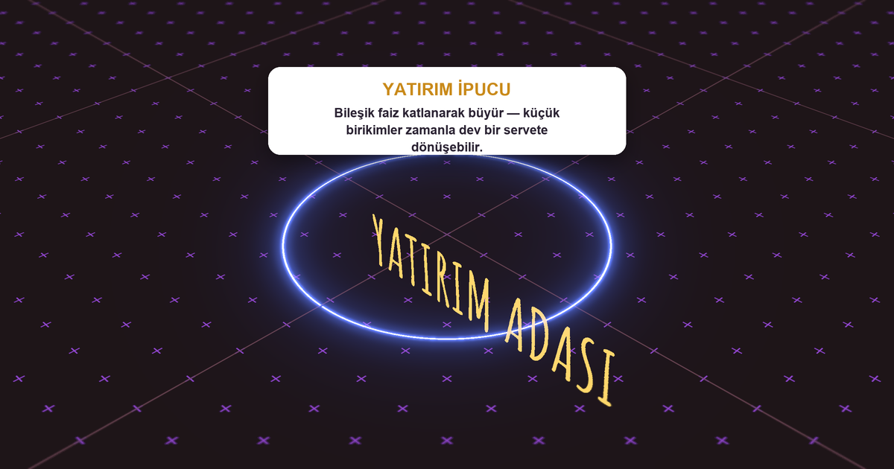

# 🏝️ Yatırım Adası

**Bir yatırım tavsiye platformunu 3D bir sürüş oyununa dönüştürme denemesi.**



**Canlı demo:** [finquest-yatirim-adasi.vercel.app](https://finquest-yatirim-adasi.vercel.app)

---

## Proje Hakkında

Yatırım Adası, klasik bir "portfolyo sitesi" formatını tamamen farklı bir amaca uyarlayan bir denemedir: kullanıcı arabasıyla adayı gezerken, karşısına **kendiliğinden beliren yatırım tavsiyeleri** ile finansal okuryazarlığını artırır. Amaç, kuru bilgi sayfaları yerine "oyun" hissi veren, sürükleyici bir deneyim üzerinden yatırım bilinci kazandırmak.

Oyun, gerçek bir 3D ada üzerinde serbestçe gezilen, fizik motorlu bir araç simülasyonu etrafında kurulu. Adada gezinirken:

- Rastgele aralıklarla (10–15 saniyede bir) ekranın üst-orta kısmında **büyük, beyaz bir kart içinde yatırım ipucu** belirir ve birkaç saniye sonra kendiliğinden kaybolur — hiçbir tuşa basmaya gerek yok, oyunun akışı hiç bozulmaz.
- **Başarımlar (achievements)** sistemi, oyuncu adada ilerledikçe otomatik olarak açılan bildirimlerle hem oyun hedefleri hem de ek yatırım bilgileri sunar (bileşik faiz, portföy çeşitlendirme, erken yatırımın gücü, araç alım-satımında değer kaybı, tatil bütçesi planlama gibi konular dahil).
- Bir **yarış pisti (circuit)**, **laboratuvar**, **proje sergisi**, **bowling alanı**, **zaman makinesi** gibi birbirinden farklı etkileşimli alanlar var; her biri kendi mini oyun mekaniğine sahip.
- Gündüz/gece döngüsü, mevsimsel değişim, dinamik hava durumu (yağmur, kar, fırtına) ve tam fizik motoru (Rapier) ile canlı bir dünya.

## Özellikler

- 🇹🇷 **Baştan sona Türkçe arayüz** — menüler, kontroller, başarımlar, bildirimler, harita.
- 💡 **Kendiliğinden beliren yatırım ipuçları** — oyuncu gezinirken periyodik olarak, oyunun akışını bozmadan gösterilir.
- 🏆 **37 başarım**, bir kısmı ek yatırım tavsiyesi içeriyor.
- 🗺️ Sürüklenebilir/yakınlaştırılabilir **harita** ve tüm alanlara hızlı erişim.
- 🏁 **Yarış pisti** — süre tutan, skor tablolu (çevrimiçi sunucu bağlıyken) bir mini yarış modu.
- 🚗 Gerçekçi **araç fiziği** (Rapier fizik motoru üzerinden), hidrolikler, korna, takla atma gibi etkileşimler.
- 🌦️ Dinamik **gündüz/gece ve mevsim döngüsü**, hava durumu efektleri (yağmur, kar, fırtına).
- 🎮 Klavye, dokunmatik ve gamepad desteği.
- ⚡ **WebGPU** destekli render motoru (desteklenmeyen tarayıcılarda otomatik WebGL'e düşer).

## Nasıl Oynanır

| Tuş | Aksiyon |
| --- | --- |
| `W` `A` `S` `D` / Ok tuşları | Hareket et |
| `Shift` | Turbo |
| `Space` | Zıpla |
| `Enter` | Etkileşim |
| `M` | Haritayı aç |
| `R` | Yeniden doğuş |
| `H` | Kornaya bas |
| Sol tık (sürükle) | Kamerayı hareket ettir |

Mobil/dokunmatik ve gamepad kontrolleri de oyun içinden **Ayarlar → Kontroller** menüsünden görüntülenebilir.

## Teknoloji

- [Three.js](https://threejs.org) (WebGPU renderer + [TSL](https://github.com/mrdoob/three.js/wiki/Three.js-Shading-Language) shader sistemi)
- [Rapier](https://rapier.rs) — fizik motoru (WASM)
- [Vite](https://vitejs.dev) — geliştirme sunucusu ve build aracı
- [GSAP](https://gsap.com) — animasyonlar
- [Howler.js](https://howlerjs.com) — ses motoru
- [Stylus](https://stylus-lang.com) — CSS ön işlemcisi

## Kurulum

```bash
# Bağımlılıkları kur
npm install --force

# Geliştirme sunucusunu başlat (localhost:1234)
npm run dev

# Prodüksiyon build'i al (dist/ klasörüne)
npm run build
```

> `--force` gerekli çünkü `vite-plugin-restart` paketi Vite 7 ile eski bir peer dependency uyumsuzluğu bildiriyor; çalışmayı etkilemiyor.

İsteğe bağlı ortam değişkenleri için `.env.example` dosyasını `.env` olarak kopyalayıp doldurabilirsiniz (sunucu URL'si, analytics ID, vb. — hepsi opsiyonel, boş bırakılırsa oyun tek oyunculu/çevrimdışı modda çalışır).

## Proje Yapısı

```
sources/          Oyun kaynak kodu (JS, Stylus stilleri, index.html)
  Game/            Ana oyun mantığı (fizik, kamera, girişler, UI sistemleri, alanlar)
  data/            Başarımlar, projeler, ülke listesi gibi statik veri
  style/           Stylus (.styl) stil dosyaları
static/           Derlenmiş/optimize edilmiş oyun varlıkları (modeller, dokular, sesler)
resources/        Ham tasarım kaynakları (Blender sahnesi, dokular — oyun tarafından kullanılmaz)
scripts/          Varlık sıkıştırma script'leri
```

## Dağıtım

Proje [Vercel](https://vercel.com) üzerinde barındırılıyor ve `main` dalına yapılan her push ile otomatik olarak yeniden dağıtılıyor. Build ayarları `vercel.json` içinde tanımlı (Vite framework preset, `npm install --force`).

## Motor Mimarisi (Geliştirici Referansı)

Aşağıdaki bölümler, motorun dahili çalışma sırasını ve varlık işleme hattını belgeleyen orijinal teknik dokümantasyondur; oyunun temel mimarisi bu depoda değiştirilmedi.

### Oyun döngüsü (tick sırası)

#### 0

- Time
- Inputs

#### 1

- Player:pre-physics (Inputs)

#### 2

- PhysicalVehicle:pre-physics (Player:pre-physics)

#### 3

- Physics

#### 4

- PhysicsWireframe (Physics)
- Objects (Physics)

#### 5

- PhysicalVehicle:post-physics (Player:pre-physics)

#### 6

- Player:post-physics (Physics, PhysicalVehicle:post-physics)

#### 7

- View (Inputs, Player:post-physics)

#### 8

- Intro
- DayCycles
- YearCycles
- Weather (DayCycles, YearCycles)
- Zones (Player:post-physics)
- VisualVehicle (PhysicalVehicle:post-physics, Inputs, Player:post-physics, View)

#### 9

- Wind (Weather)
- Lighting (DayCycles, View)
- Tornado (DayCycles, PhysicalVehicle)
- InteractivePoints (Player:post-physics)
- Tracks (VisualVehicle)

#### 10

- Area++ (View, PhysicalVehicle:post-physics, Player:post-physics, Wind)
- Foliage (VisualVehicle, View)
- Fog (View)
- Reveal (DayCycles)
- Terrain (Tracks)
- Trails (PhysicalVehicle)
- Floor (View)
- Grass (View, Wind)
- Leaves (View, PhysicalVehicle)
- Lightnings (View, Weather)
- RainLines (View, Weather, Reveal)
- Snow (View, Weather, Reveal, Tracks)
- VisualTornado (Tornado)
- WaterSurface (Weather, View)
- Benches (Objects)
- Bricks (Objects)
- ExplosiveCrates (Objects)
- Fences (Objects)
- Lanterns (Objects)
- Whispers (Player)

#### 13

- InstancedGroup (Objects, [SpecificObjects])

#### 14

- Audio (View, Objects)
- Notifications
- Title (PhysicalVehicle:post-physics)

#### 998

- Rendering

#### 999

- Monitoring

### Blender / Varlık İşleme Hattı

#### Dışa Aktarım (Export)

- Palet dokusu düğümünü sessize al (Three.js `Material` içinde doğrudan yükleniyor ve ayarlanıyor)
- İlgili export preset'lerini kullan
- Sıkıştırma uygulama (daha sonra yapılacak)

#### Sıkıştırma (Compress)

`npm run compress` komutunu çalıştırın. Bu komut:

**GLB dosyaları**
- `static/` klasöründeki glb dosyalarını tarar (zaten sıkıştırılmış olanları atlar)
- Gömülü dokuları `etc1s --quality 255` ile sıkıştırır (kayıplı, GPU dostu)
- Orijinalleri korumak için yeni dosyalar oluşturur

**Doku dosyaları**
- `static/` klasöründeki `png|jpg` dosyalarını tarar (model dışı klasörleri atlar)
- Varsayılan `--encode etc1s --qlevel 255` ile veya yola özel bir preset ile sıkıştırır
- Orijinalleri korumak için yeni dosyalar oluşturur

**UI dosyaları**
- `static/ui` klasöründeki `png|jpg` dosyalarını tarar
- WebP'ye sıkıştırır

**Kaynaklar**
- https://gltf-transform.dev/cli
- https://github.com/KhronosGroup/KTX-Software
- https://github.khronos.org/KTX-Software/ktxtools/toktx.html

## Bu Proje Hakkında

Yatırım Adası, [Bruno Simon](https://github.com/brunosimon)'un açık kaynaklı [folio-2025](https://github.com/brunosimon/folio-2025) portfolyo şablonu temel alınarak geliştirilmiştir (MIT lisansı). Orijinal proje bir kişisel portfolyo sitesiyken, bu sürümde:

- Tüm marka/kişisel içerikler kaldırıldı veya nötrleştirildi,
- Arayüz ve oyun içi tüm metinler Türkçeye çevrildi,
- Dini referans içeren bölümler tamamen kaldırıldı,
- Oyun mantığı yatırım/finans temasına uyarlandı ve kendiliğinden beliren yatırım tavsiyesi sistemi eklendi.

Kullanılan render motoru, fizik motoru ve genel oyun mimarisi orijinal projeden miras kalmıştır; oyunun temasını, dilini ve içeriğini değiştiren tüm uyarlamalar bu depoda yapılmıştır.

## Katkıda Bulunanlar

- **Betül Kaya**

## Lisans

[MIT](./license.md)
